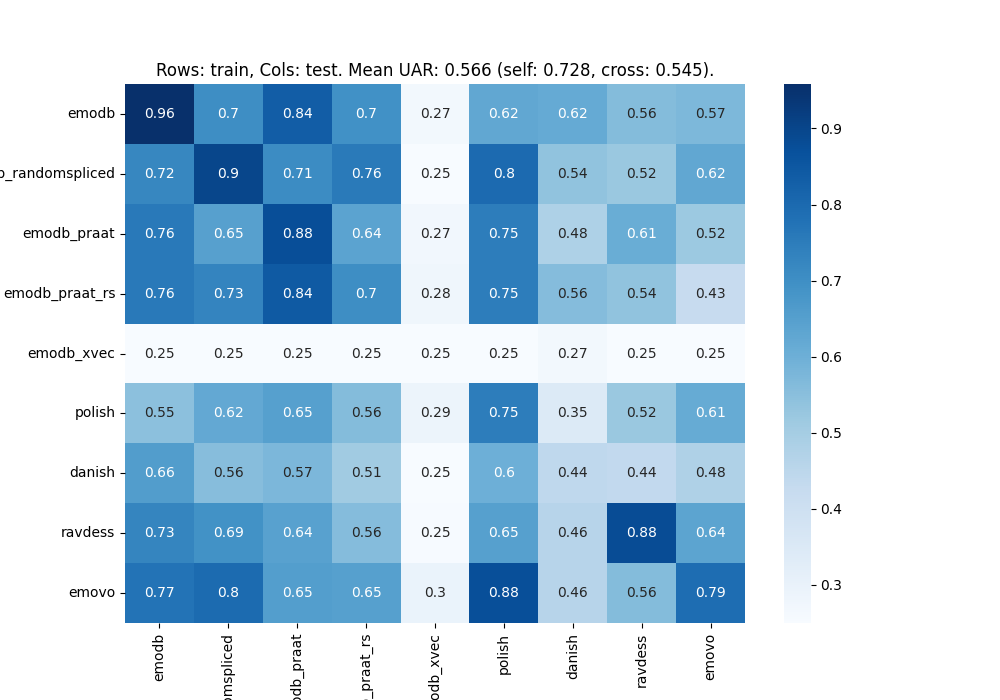
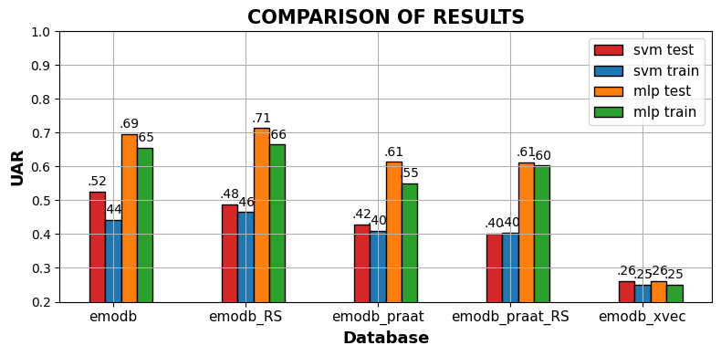

Examples of speaker anonymization approaches with emotional speech samples.

The samples are based on two phrases (a02 and b09) from the [Berlin Emodb emotional acted database](https://zenodo.org/records/7447302).

In the figure you see a heatmap for 81 experiments, each time using one of the anonymized databases as well as 4 other international emotion-acted databases as test vs. training set, repectively (keeping predefined splits). The emotions were unified to the classes *neutral*, *angry*, *happy* and *sad*. Classifiers are trained with [pre-trained wav2vec2.0 embeddings](https://huggingface.co/audeering/wav2vec2-**large**-robust-12-ft-emotion-msp-dim) and a 3-layer Multi Layer Perceptron. Experiments done with [nkululeko](https://github.com/felixbur/nkululeko) 

The approaches are:
* **random-splicing**: cutting samples to small chunks and [re-arranging them in random order](http://felix.syntheticspeech.de/publications/Random_splicing_ICASSP-2.pdf)
* **praat**: gender shift with the [Praat software](https://www.fon.hum.uva.nl/praat/)
* **praat_randomspliced**: combination of the two above
* **xvec_ecapa_pool**: shifting latent space embeddings

We also did the experiments with a SVM classifier and combined expert features [opensmile eGeMAPS](https://audeering.github.io/opensmile-python/api/opensmile.FeatureSet.html) and [Praat](https://github.com/drfeinberg/PraatScripts). In the next Figure you see the results averaged when being used as test data or training data.

|        Name         |                         Description                         | Phrase |                                               neutral                                               |                                               anger                                               |                                               happiness                                               |                                               fear                                               |                                               sadness                                               |                                               boredom                                               |                                               disgust                                               |
| :-----------------: | :---------------------------------------------------------: | :----: | :-------------------------------------------------------------------------------------------------: | :-----------------------------------------------------------------------------------------------: | :---------------------------------------------------------------------------------------------------: | :----------------------------------------------------------------------------------------------: | :-------------------------------------------------------------------------------------------------: | :-------------------------------------------------------------------------------------------------: | :-------------------------------------------------------------------------------------------------: |
|      original       |                  original reference audio                   |  a02   |      <audio controls><source src="results/original/a02_neutral.wav" type="audio/wav"></audio>       |      <audio controls><source src="results/original/a02_anger.wav" type="audio/wav"></audio>       |      <audio controls><source src="results/original/a02_happiness.wav" type="audio/wav"></audio>       |      <audio controls><source src="results/original/a02_fear.wav" type="audio/wav"></audio>       |      <audio controls><source src="results/original/a02_sadness.wav" type="audio/wav"></audio>       |      <audio controls><source src="results/original/a02_boredom.wav" type="audio/wav"></audio>       |      <audio controls><source src="results/original/a02_disgust.wav" type="audio/wav"></audio>       |
|                     |                                                             |  b09   |      <audio controls><source src="results/original/b09_neutral.wav" type="audio/wav"></audio>       |      <audio controls><source src="results/original/b09_anger.wav" type="audio/wav"></audio>       |      <audio controls><source src="results/original/b09_happiness.wav" type="audio/wav"></audio>       |      <audio controls><source src="results/original/b09_fear.wav" type="audio/wav"></audio>       |      <audio controls><source src="results/original/b09_sadness.wav" type="audio/wav"></audio>       |      <audio controls><source src="results/original/b09_boredom.wav" type="audio/wav"></audio>       |      <audio controls><source src="results/original/b09_disgust.wav" type="audio/wav"></audio>       |
|        praat        |            Gender shift with Praat manipulation.            |  a02   |        <audio controls><source src="results/praat/a02_neutral.wav" type="audio/wav"></audio>        |        <audio controls><source src="results/praat/a02_anger.wav" type="audio/wav"></audio>        |        <audio controls><source src="results/praat/a02_happiness.wav" type="audio/wav"></audio>        |        <audio controls><source src="results/praat/a02_fear.wav" type="audio/wav"></audio>        |        <audio controls><source src="results/praat/a02_sadness.wav" type="audio/wav"></audio>        |        <audio controls><source src="results/praat/a02_boredom.wav" type="audio/wav"></audio>        |        <audio controls><source src="results/praat/a02_disgust.wav" type="audio/wav"></audio>        |
|                     |                                                             |  b09   |        <audio controls><source src="results/praat/b09_neutral.wav" type="audio/wav"></audio>        |        <audio controls><source src="results/praat/b09_anger.wav" type="audio/wav"></audio>        |        <audio controls><source src="results/praat/b09_happiness.wav" type="audio/wav"></audio>        |        <audio controls><source src="results/praat/b09_fear.wav" type="audio/wav"></audio>        |        <audio controls><source src="results/praat/b09_sadness.wav" type="audio/wav"></audio>        |        <audio controls><source src="results/praat/b09_boredom.wav" type="audio/wav"></audio>        |        <audio controls><source src="results/praat/b09_disgust.wav" type="audio/wav"></audio>        |
| praat_randomspliced |           Praat gender shift with random splicing           |  a02   | <audio controls><source src="results/praat_randomspliced/a02_neutral.wav" type="audio/wav"></audio> | <audio controls><source src="results/praat_randomspliced/a02_anger.wav" type="audio/wav"></audio> | <audio controls><source src="results/praat_randomspliced/a02_happiness.wav" type="audio/wav"></audio> | <audio controls><source src="results/praat_randomspliced/a02_fear.wav" type="audio/wav"></audio> | <audio controls><source src="results/praat_randomspliced/a02_sadness.wav" type="audio/wav"></audio> | <audio controls><source src="results/praat_randomspliced/a02_boredom.wav" type="audio/wav"></audio> | <audio controls><source src="results/praat_randomspliced/a02_disgust.wav" type="audio/wav"></audio> |
|                     |                                                             |  b09   | <audio controls><source src="results/praat_randomspliced/b09_neutral.wav" type="audio/wav"></audio> | <audio controls><source src="results/praat_randomspliced/b09_anger.wav" type="audio/wav"></audio> | <audio controls><source src="results/praat_randomspliced/b09_happiness.wav" type="audio/wav"></audio> | <audio controls><source src="results/praat_randomspliced/b09_fear.wav" type="audio/wav"></audio> | <audio controls><source src="results/praat_randomspliced/b09_sadness.wav" type="audio/wav"></audio> | <audio controls><source src="results/praat_randomspliced/b09_boredom.wav" type="audio/wav"></audio> | <audio controls><source src="results/praat_randomspliced/b09_disgust.wav" type="audio/wav"></audio> |
|   random_spliced    |                Random splicing anonymization                |  a02   |   <audio controls><source src="results/random_spliced/a02_neutral.wav" type="audio/wav"></audio>    |   <audio controls><source src="results/random_spliced/a02_anger.wav" type="audio/wav"></audio>    |   <audio controls><source src="results/random_spliced/a02_happiness.wav" type="audio/wav"></audio>    |   <audio controls><source src="results/random_spliced/a02_fear.wav" type="audio/wav"></audio>    |   <audio controls><source src="results/random_spliced/a02_sadness.wav" type="audio/wav"></audio>    |   <audio controls><source src="results/random_spliced/a02_boredom.wav" type="audio/wav"></audio>    |   <audio controls><source src="results/random_spliced/a02_disgust.wav" type="audio/wav"></audio>    |
|                     |                                                             |  b09   |   <audio controls><source src="results/random_spliced/b09_neutral.wav" type="audio/wav"></audio>    |   <audio controls><source src="results/random_spliced/b09_anger.wav" type="audio/wav"></audio>    |   <audio controls><source src="results/random_spliced/b09_happiness.wav" type="audio/wav"></audio>    |   <audio controls><source src="results/random_spliced/b09_fear.wav" type="audio/wav"></audio>    |   <audio controls><source src="results/random_spliced/b09_sadness.wav" type="audio/wav"></audio>    |   <audio controls><source src="results/random_spliced/b09_boredom.wav" type="audio/wav"></audio>    |   <audio controls><source src="results/random_spliced/b09_disgust.wav" type="audio/wav"></audio>    |
|   xvec_ecapa_pool   | "x_vec + ecapa" speaker embeddings based pool anonymization |  a02   |   <audio controls><source src="results/xvec_ecapa_pool/a02_neutral.wav" type="audio/wav"></audio>   |   <audio controls><source src="results/xvec_ecapa_pool/a02_anger.wav" type="audio/wav"></audio>   |   <audio controls><source src="results/xvec_ecapa_pool/a02_happiness.wav" type="audio/wav"></audio>   |   <audio controls><source src="results/xvec_ecapa_pool/a02_fear.wav" type="audio/wav"></audio>   |   <audio controls><source src="results/xvec_ecapa_pool/a02_sadness.wav" type="audio/wav"></audio>   |   <audio controls><source src="results/xvec_ecapa_pool/a02_boredom.wav" type="audio/wav"></audio>   |   <audio controls><source src="results/xvec_ecapa_pool/a02_disgust.wav" type="audio/wav"></audio>   |
|                     |                                                             |  b09   |   <audio controls><source src="results/xvec_ecapa_pool/b09_neutral.wav" type="audio/wav"></audio>   |   <audio controls><source src="results/xvec_ecapa_pool/b09_anger.wav" type="audio/wav"></audio>   |   <audio controls><source src="results/xvec_ecapa_pool/b09_happiness.wav" type="audio/wav"></audio>   |   <audio controls><source src="results/xvec_ecapa_pool/b09_fear.wav" type="audio/wav"></audio>   |   <audio controls><source src="results/xvec_ecapa_pool/b09_sadness.wav" type="audio/wav"></audio>   |   <audio controls><source src="results/xvec_ecapa_pool/b09_boredom.wav" type="audio/wav"></audio>   |   <audio controls><source src="results/xvec_ecapa_pool/b09_disgust.wav" type="audio/wav"></audio>   |
